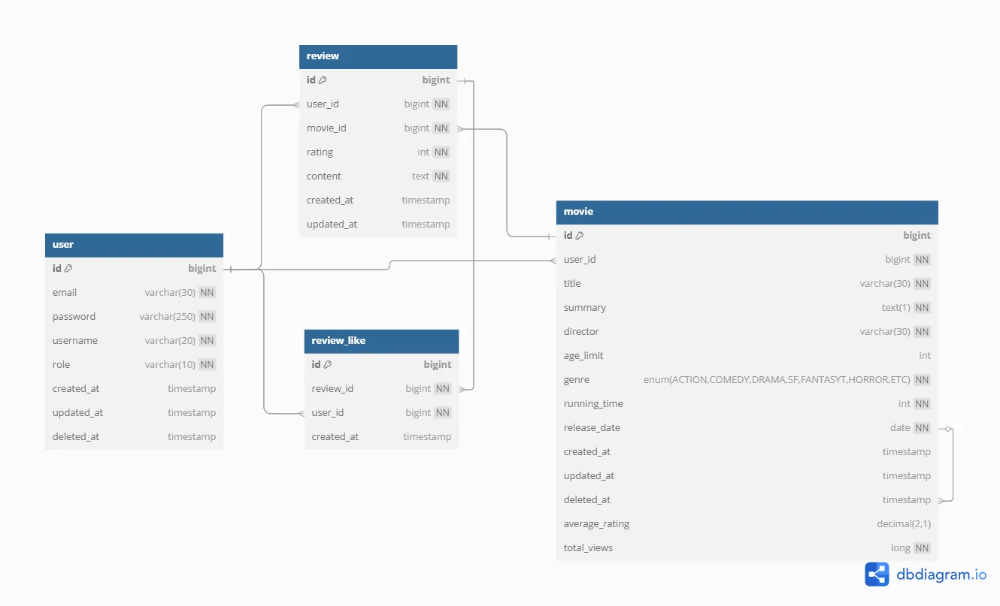

# 📽️ 영화 리뷰 커뮤니티 - 25Frames 🎞️
## 🗂️ 프로젝트 개요
- **프로젝트 기간**: 2025.05.16 ~ 2025.05.26
- **프로젝트 소개**: 캐싱을 활용해 빠르고 효율적인 영화 리뷰 커뮤니티를 제공합니다.
- **프로젝트 목표**
    - 성능 최적화 중심의 캐싱 기능 구현
    - 역할 기반 접근 제어와 커뮤니티 기능
      <br><br>

## 🛠️ 사용 기술 스택
- **🖥️ Back-End**: Java 17, Spring Boot 3, Spring Security + JWT, Spring Data JPA
- **🛢️ Database**: MySQL (Docker 기반)
- **🧰 Caching**: Redis (Docker 기반)
- **🐳 Dev Environment**: Docker
- **⚙️ Build Tool**: Gradle
- **🌿 Version Control**: Git, GitHub
- **📮 API Development Tool**: notion, postman
  <br><br>

## 🗺️ ERD


### 🖍️ 와이어 프레임 🔗 [wiki로 연결](https://github.com/Deabaind/Sparta_Spring_25Frames/wiki/%EC%99%80%EC%9D%B4%EC%96%B4%ED%94%84%EB%A0%88%EC%9E%84)
### 📄 API 문서 🔗 [Postman으로 연결](https://documenter.getpostman.com/view/43234443/2sB2qajMst#intro)
### 🔍 SA 문서 및 트러블 슈팅 🔗 [notion으로 연결](https://www.notion.so/Chapter-4-S-A-1dc1e5c01907809d8c88c72ac1592d85#1e31e5c0190780f5b3cacb9ff384a198)
<br>

## 🧱인프라 아키텍쳐& 적용기술
```
[사용자]
   |
   v
[Frontend]
   |
   v
[Backend (Spring Boot)]
   |
   |---> [JWT Authentication Filter]
   |
   |---> [Controller]
           |
           v
       [Service Layer]
           |
           v
       [Repository Layer]
           |
           v
       [MySQL Database]
           ^
           |
       [Redis Cache] <--- [Scheduler (Spring)]
```
***🔐 JWT (JSON Web Token)***   
세션 없이도 사용자의 인증 상태를 유지할 수 있어 무상태(Stateless)한 서비스에 적합
확장성 있는 REST API 설계에 유리하며, 클라이언트가 토큰을 보관하므로 서버 부하가 줄어듦

***🐬 MySQL***   
가장 널리 사용되는 관계형 데이터베이스로, SQL 기반 쿼리와 트랜잭션 처리에 안정적
프로젝트 규모와 요구사항에 비해 설정과 운용이 간편하고 학습 장벽이 낮음
팀원들 간 공통 이해도가 높아 선택

***🧠 Redis***   
메모리 기반의 데이터 저장소로, 데이터 접근 속도가 매우 빠름
조회수, 인기 검색어 등 자주 변경되고 빠르게 접근해야 하는 데이터 캐싱에 최적화
TTL, 블랙리스트 처리 등 유연한 캐시 제어가 가능

***🐳 Docker***   
OS 환경에 상관없이 동일한 실행 환경을 제공 → “개발 환경 통일”과 “배포 편의성” 확보
DB, Redis, 백엔드 등을 각각의 컨테이너로 분리하여 모듈화된 시스템 구성이 가능
<br><br>

## 🚩 주요 기능
### 1️⃣ 성능 최적화: Redis 기반 캐싱
- Redis를 활용해 영화 조회수, 인기 검색어, 인기 영화 랭킹 등을 캐싱하여 응답 속도 개선
- 조회 요청 시 DB 접근 없이 캐시에서 처리하여 트래픽 부하를 줄이고, 처리 성능을 안정화
- 반복 검색이나 실시간 인기 데이터 제공에 최적화된 구조

### 2️⃣ 사용자 인증 및 권한 관리: JWT + Redis 기반
- 사용자 로그인 시 JWT 토큰 발급, 서버는 토큰을 검증해 사용자 인증/인가 수행
- Redis를 통해 리프레시 토큰을 저장하며, 로그아웃된 토큰은 블랙리스트에 저장
- 사용자 역할은 비회원 / USER / PROVIDER로 구분되어, 각 역할별로 접근 가능한 기능이 명확히 나뉨
- 인증되지 않은 요청에는 401, 권한 없는 요청에는 403 응답을 반환

### 3️⃣ 영화 관리: 캐싱 기반 성능 최적화 및 랭킹 기능
- 공급자(PROVIDER)는 영화를 등록·수정하고, 일반 사용자는 영화를 조회할 수 있음
- Redis 캐싱을 통해 영화 검색 요청을 빠르게 처리하고, 반복 요청을 줄임
- 검색 데이터를 활용해 자주 검색되는 키워드를 분석하여 인기 검색어 제공
- 평점 기반으로 인기 영화 랭킹을 조회할 수 있는 기능 포함

### 4️⃣ 리뷰 기능: 사용자 참여 기반 콘텐츠 및 캐시 연동
- 사용자(USER)는 영화에 대한 리뷰를 등록, 수정하고 다른 사용자의 리뷰를 조회 가능
- 마음에 드는 리뷰에 좋아요를 눌러 커뮤니티적 상호작용 지원
- 리뷰 작성 시 영화 랭킹 관련 캐시를 최신 상태로 갱신하여 데이터 일관성 유지

### 5️⃣ 스케줄러를 통한 배치 처리
- Spring Scheduler를 활용하여 매일 자정, Redis에 저장된 조회수를 DB에 일괄 반영
- 이후 Redis 캐시를 초기화하여 메모리 자원 낭비를 방지하고, 다음 날 데이터를 준비

### 6️⃣ Docker를 활용한 개발 환경 통일
- MySQL, Redis와 같은 주요 환경을 Docker로 컨테이너화하여 개발 환경을 표준화
- 개발-테스트 간 차이를 줄여 협업 효율성 향상 및 설정 오류 최소화
  <br><br>

## 🌟 팀원 소개
### 역할 분담
| 이름  | gitHub                                    | 역할                                    |
|:----|:------------------------------------------|:--------------------------------------|
| 심재민 | 　[🦊](https://github.com/Deabaind)        | 사용자 인증&인가 및 유저 기능, MySQL, Redis 도커 세팅 |
| 강수현 | 　[🐍](https://github.com/iop0217)         | 영화 검색 및 redis기반 인기 검색어 조회             |
| 남유리 | 　[🍇](https://github.com/namyuriprincess) | 리뷰/평점 CRUD                            |
| 이관희 | 　[🦦](https://github.com/yigani)          | 평점 기반 영화 랭킹 조회                        |
| 이은지 | 　[🐝](https://github.com/222eunji)      | 영화 CRUD 및 영화 조회수 캐싱                   |

### 협업규칙
1. 매일 아침,저녁으로 진행상황 공유
2. 1PR 당 1명 이상 리뷰 필수